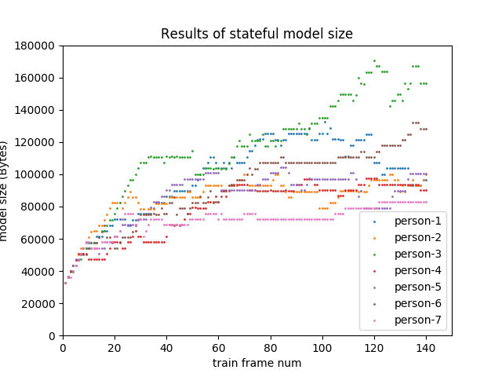
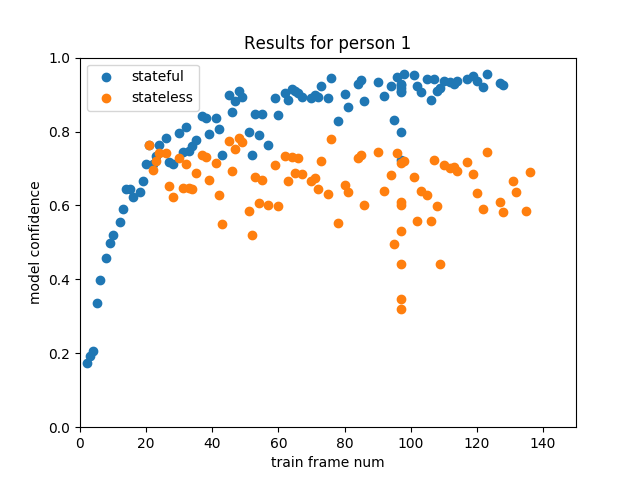
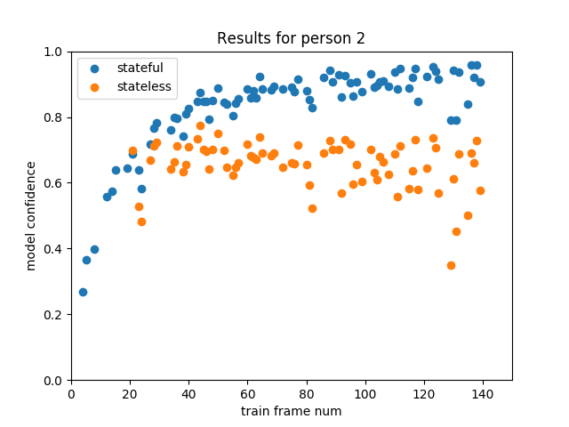
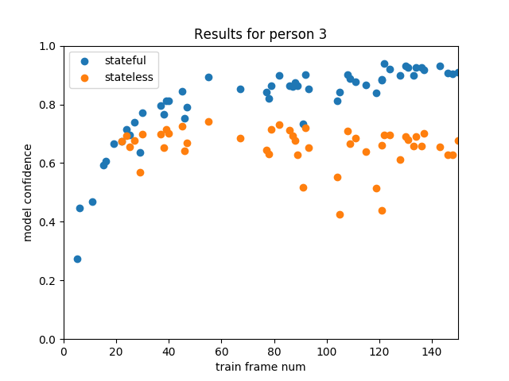
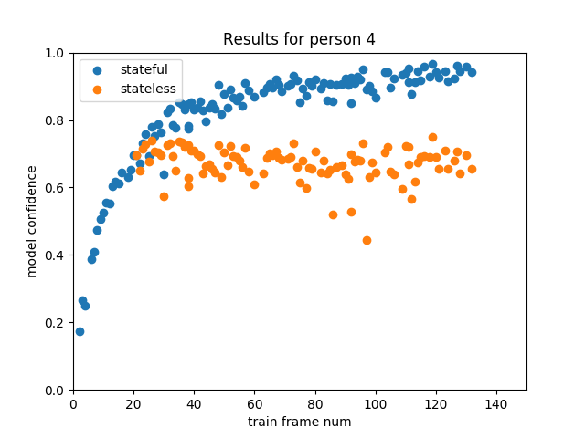
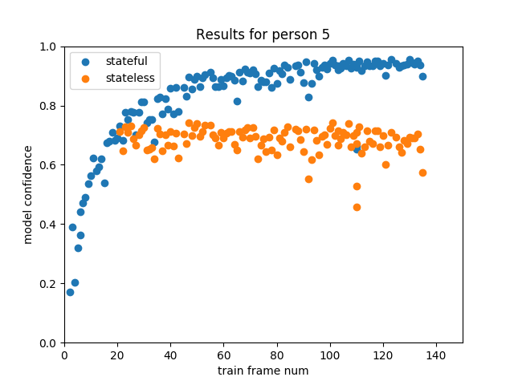
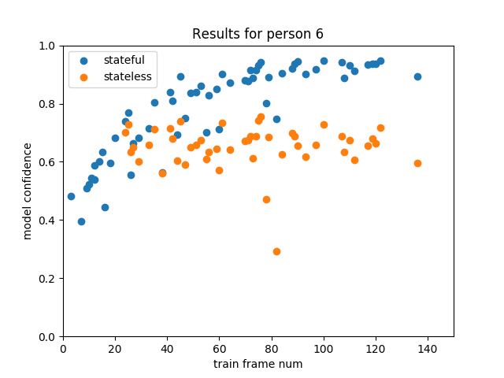
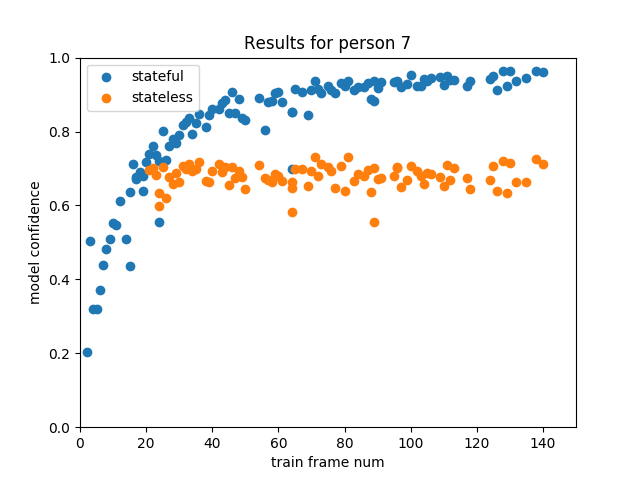

# Openface Experiment 2
This repo is an experiment with support of [Openface](http://cmusatyalab.github.io/openface/). For the [face classifaction application](http://cmusatyalab.github.io/openface/demo-3-classifier/#2-preprocess-the-raw-images), the relationship between training sample number vs. model size vs. model accuracy \& confidence is studied in this experiment.

## Experiment procedure
Please follow `./run_experiment.sh` for each step of the experiment. There are mainly 5 steps as listed below

* Download the dataset by extracting txts
* Prune the dataset to different size (to make models of different maturity)
* Preprocess: Align the faces for each dataset
* Generate representation for each dataset
* Train models for each dataset
* Predict with test images and get results

## Experiment results

1. Model size
To get results, run `./utils/plot_model_size.py`.

2. Model confidence compare: stateful vs. stateless

